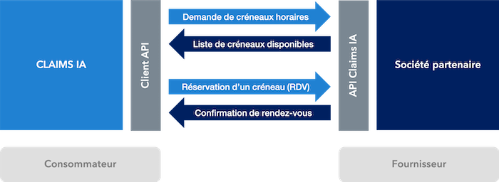

# Principe général

L'API RDV définit les échanges entre **Claims IA** et les sociétés d'**expertise** ou de **REN** permettant à l'application _Claims MRH_ de prendre des rendez-vous pour ses utilisateurs assurés.

Cette API est générique et agnostique.
Claims MRH est client de cette API. Les sociétés qui souhaitent s'interfacer avec Claims IA doivent donc l'implémenter.

## Flux

