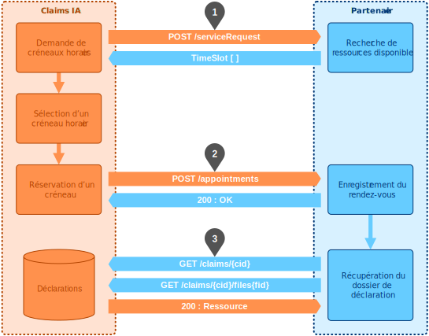

# Flux

La prise de rendez-vous s'effectue en 3 temps:

- **Etape 1** : Claims IA fait de demande de créneaux disponibles pour le rendez-vous.
  - La demande est accompagnée d'informations sur la déclaration de sinistre
  - Le partenaire fournit en retour une liste de créneaux horaires
- **Etape 2** : Claims IA réserve un créneau, qui devient associé au rendez-vous
  - Le partenaire fournit en retour les informations sur le rendez-vous
- **Etape 3** : En différé, le partenaire peut récupérer
  - les informations détaillées sur le dossier de déclaration
  - les documents fournis par l'assuré (photos, justificatifs)

L'API intègre également d'autres méthodes (optionnelles en v1) pour

- Modifier certaines informations du rendez-vous
- Annuler et replanifier un rendez-vous

L'API respecte le standard REST et utilise le protocole HTTP. Les messages échangés sont au format JSON.

Une clé est nécessaire pour utiliser l'API. Cette clé doit être fournie par la société qui implémente l'API.

# Données échangées

<!--
type: tab
title: Demande de créneaux - Expert
-->

## Etape 1 : Demande de créneaux horaires

Les envoyées par Claims IA doivent être suffisantes pour que le partenaire Expert puisse déterminer quels crénaux sont libres en fonction de ses ressources (experts).   

| Données                      |  Remarques                         |
| :--------------------------- |  :-------------------------------- |
| Assureur                     |  Identifiant de l'assureur         |
| Type assuré                  |  Particulier, PRO                  |
| Type de sinistre             |  _DDE, DE, CATNAT, VOL_            |
| Type d'expertise             |  VISIO, EAD, ESS, CONTRADICTOIRE   |
| Type d'habitation            |                                    |
| Enjeu                        |  TTC                               |
| Enjeu DM                     |  TTC                               |
| Enjeu DI                     |  TTC                               |
| Lieu de RDV                  |                                    |
| _Géocodage lieu RDV_         |  V2                                |
| 
                         |  
                              |
| Processus                    |  Champ libre. A définir            |

<!--
type: tab
title: Demande de créneaux - REN
-->

## Etape 1 : Demande de créneaux horaires

Les envoyées par Claims IA doivent être suffisantes pour que le partenaire Artisan puisse déterminer quels crénaux sont libres.   

<!-- theme: warning -->

> ### A compléter
>
> Définir la liste des données à transmettre

<!--
type: tab
title: Récupération du dossier
-->

## Etape 4 : Récupération du dossier par le partenaire

| Données                      | Remarques                         |
| :--------------------------- | :-------------------------------- |
| Assureur                     | Identifiant de l'assureur         |
| Contrat                      | Nom du contrat                    |
| N° contrat                   | Réf. assureur du contrat          |
| Ref Claims IA                | Réf. interne de la déclaration    |
| Ref Sinistre                 | Réf. assureur du sinistre         |
| Qualité de l'assuré          | CPO, LOC, PNO, ...                |
| Type assuré                  | Particulier, PRO                  |
| Adresse du risque            |                                   |
| Type de sinistre             | _DDE, DE, CATNAT, VOL_            |
| Type d'expertise             | VISIO, EAD, ESS, CONTRADICTOIRE   |
| Date du sinistre             |                                   |
| Date de la déclaration       |                                   |
| Type d'habitation            |                                   |
| Adresse du risque            |                                   |
| Enjeu                        | TTC                               |
| Enjeu DM                     | TTC                               |
| Enjeu DI                     | TTC                               |
| Lieu de RDV                  |                                   |
| _Géocodage lieu RDV_         | V2                                |
| Liste des dommages immo      | Avec ou sans chiffrage ?          |
| Liste des dommages mobiliers | Avec ou sans chiffrage ?          |
| Pièces-jointes               | URL des documents                 |
| Identité de l'assuré         | Différent du contact RDV          |
| Identité du contact RDV      | Si la personne n'est pas l'assuré |
| 
                         | 
                              |
| Processus                    | Champ libre. A définir            |
| 
                         | 
                              |
| `EAD` : Données de connexion |                                   |

<!-- type: tab-end -->

