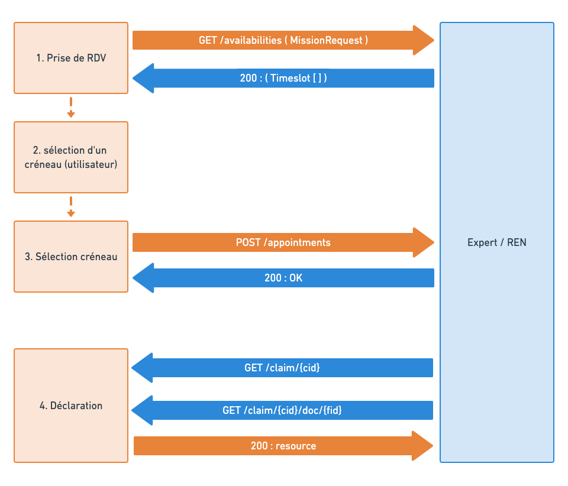

# Introduction

**Claims MRH** est une application de selfcare permettant à un assuré de déclarer un sinistre en ligne.
A l'issue de sa déclaration, l'assuré pourra être redirigé vers un expert ou un artisan selon la nature et la gravité du problème.

L'API RDV de Claims IA permet la prise de rendez-vous expertise ou REN depuis l'application Claims MRH. A ce titre, elle doit être implémentée par les sociétés qui souhaitent fournir ce service de prise de rendez-vous.

# Flux

La prise de rendez-vous s'effectue en 3 temps:

- **Etape 1** : Claims IA fait de demande de créneaux disponibles pour le rendez-vous.
  - La demande est accompagnée d'informations sur la déclaration de sinistre
  - Le partenaire fournit en retour une liste de créneaux
- **Etape 2** : L'utilisateur choisit un des créneaux horaires proposés
- **Etape 3** : Claims IA réserve un créneau, qui devient affecté au rendez-vous
  - Le partenaire fournit en retour les informations sur le rendez-vous

**Etape 4** : En différé, le partenaire peut récupérer

- les informations détaillées sur le dossier de déclaration
- les documents fournis par l'assuré

L'API intègre également d'autres méthodes (optionnelles en v1) pour

- Modifier certaines informations du rendez-vous
- Annuler et replanifier un rendez-vous

L'API respecte le standard REST et utilise le protocole HTTP. Les messages échangés sont au format JSON.

Une clé est nécessaire pour utiliser l'API. Cette clé doit être fournie par la société qui implémente l'API.

# Données échangées

Liste des informations transmises par Claims IA au partenaire.
Les données sont soit :

- **\|––>** envoyées dans la requête émise par Claims IA (_endpoint partennaire_)
- **\|<––** fournies en réponse à une requête du partenaire (_endpoint Claims IA_)

<!-- title: Liste des champs transmis -->

| Données                      | Créneaux hor. | Rendez-vous | Remarques                         |
| :--------------------------- | :-----------: | :---------: | :-------------------------------- |
| Assureur                     |     \|––>     |    \|––>    | Identifiant de l'assureur         |
| Contrat                      |               |    \|<––    | Nom du contrat                    |
| N° contrat                   |               |    \|––>    | Réf. assureur du contrat          |
| Ref Claims IA                |               |    \|––>    | Réf. interne de la déclaration    |
| Ref Sinistre                 |               |    \|––>    | Réf. assureur du sinistre         |
| Qualité de l'assuré          |               |    \|<––    | CPO, LOC, PNO, ...                |
| Type assuré                  |     \|-->     |    \|-->    | Particulier, PRO                  |
| Adresse du risque            |               |    \|<––    |                                   |
| Type de sinistre             |     \|––>     |    \|––>    | _DDE, DE, CATNAT, VOL_            |
| Type d'expertise             |     \|––>     |    \|––>    | VISIO, EAD, ESS, CONTRADICTOIRE   |
| Date du sinistre             |               |    \|––>    |                                   |
| Date de la déclaration       |               |    \|––>    |                                   |
| Type d'habitation            |     \|––>     |    \|––>    |                                   |
| Adresse du risque            |               |    \|––>    |                                   |
| Enjeu                        |     \|––>     |    \|––>    | TTC                               |
| Enjeu DM                     |     \|––>     |    \|––>    | TTC                               |
| Enjeu DI                     |     \|––>     |    \|––>    | TTC                               |
| Lieu de RDV                  |     \|––>     |    \|––>    |                                   |
| _Géocodage lieu RDV_         |     \|––>     |    \|––>    | V2                                |
| Liste des dommages immo      |               |    \|<––    | Avec ou sans chiffrage ?          |
| Liste des dommages mobiliers |               |    \|<––    | Avec ou sans chiffrage ?          |
| Pièces-jointes               |               |    \|<––    | URL des documents                 |
| Identité de l'assuré         |               |    \|<––    | Différent du contact RDV          |
| Identité du contact RDV      |               |    \|<––    | Si la personne n'est pas l'assuré |
| 
                         |     
      |    
     | 
                              |
| USAGE FUTUR                  |               |             |                                   |
| 
                         |     
      |    
     | 
                              |
| Processus                    |     \|––>     |    \|––>    | Champ libre. A définir            |
| 
                         |     
      |    
     | 
                              |
| `ESS` : Lieu de RDV souhaité |     \|––>     |    \|––>    |                                   |
| `EAD` : Données de connexion |               |    \|<––    |                                   |

> **\|––>** Données transmises par claims IA
>
> **\|<––** Données récupérées par le partenaire

## Montants HT / TTC

- Enjeu en TTC. A valider avec le métier
